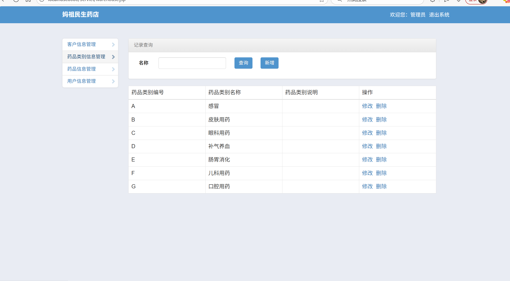
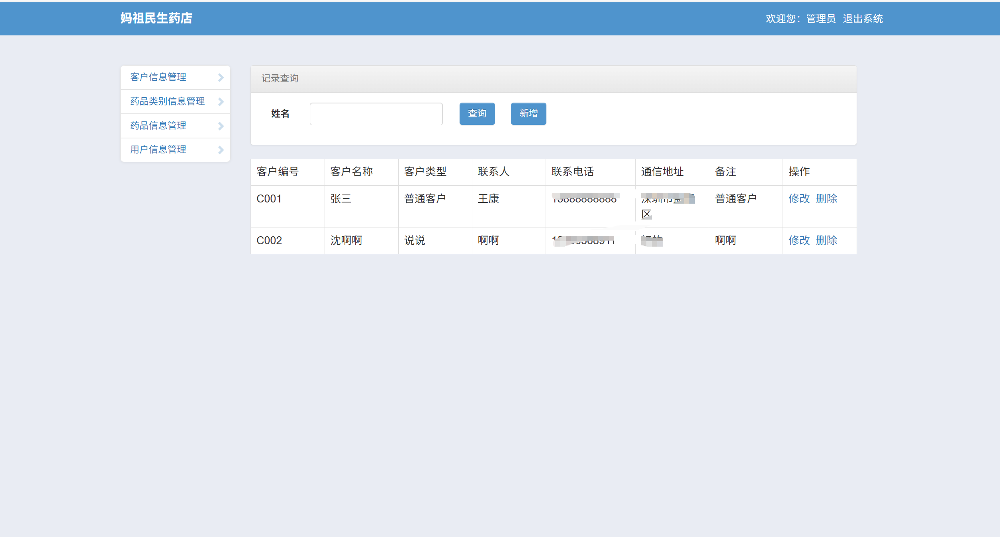
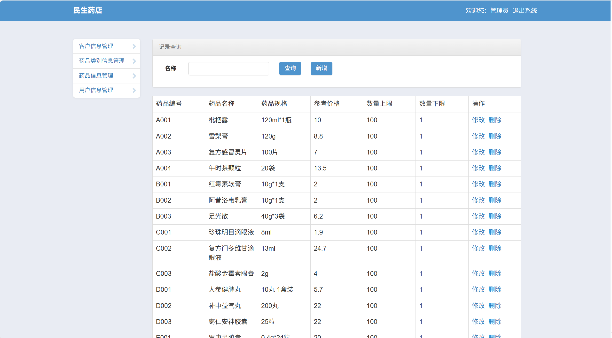
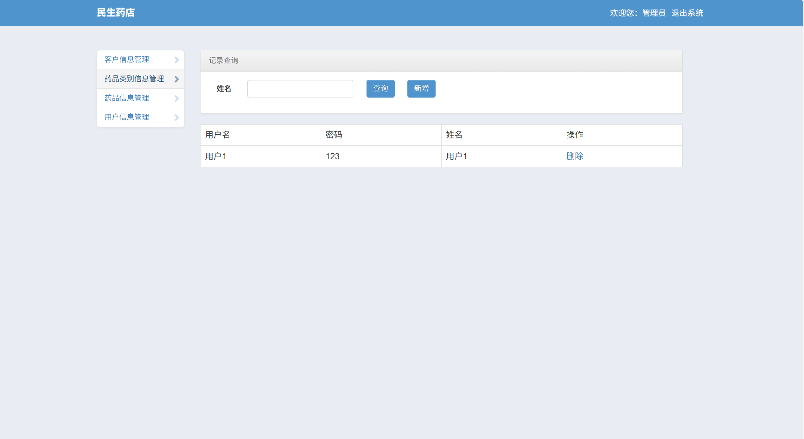
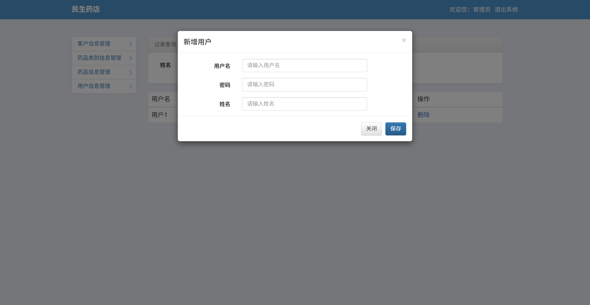
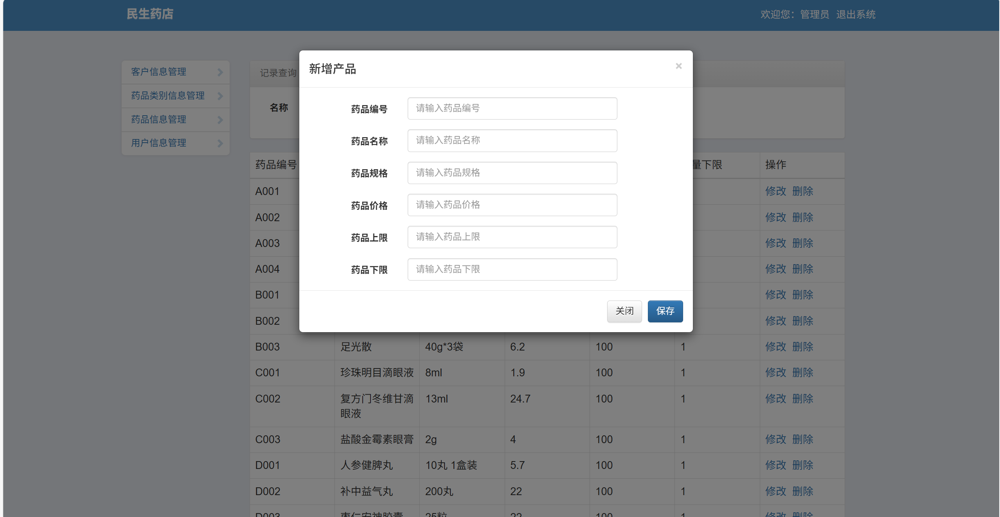
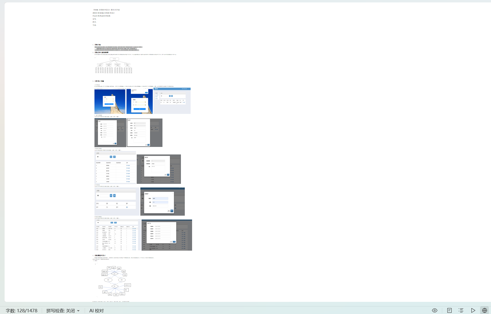

# jspServlet015
jspServlet015药店管理系统+BG
 
## 查看主页获取源码

### 一、关键词

药店管理系统，药店系统

### 二、作品包含
源码+数据库+设计报告文档+全套环境和工具资源+本地部署教程

### 三、项目技术
前端技术：Html、Css、Js、Jquery、Bootstrap
后端技术：Java、JSP、Servlet、JDBC

### 四、运行环境（以下版本亲测，其他版本兼容性请自行测试）
开发工具：IDEA/eclipse

数据库：MySQL5.7或8.0

服务器：Tomcat8.5或Tomcat9.0

数据库管理工具：Navicat10以上版本

环境配置软件： JDK1.8

浏览器：谷歌浏览器

### 五、项目介绍
项目编号：jspServlet015

药店管理系统是一套针对药店日常运营与管理所设计开发的信息化软件系统，旨在提升药店的运营效率、优化库存管理、增强客户服务质量。

该系统围绕用户登录，提供客户、药品类别、药品信息、用户四大管理模块，每个模块均支持添加、删除、查询、修改对应信息，实现对客户、药品分类及基础数据、系统用户的全流程维护 。

### 六、运行截图

